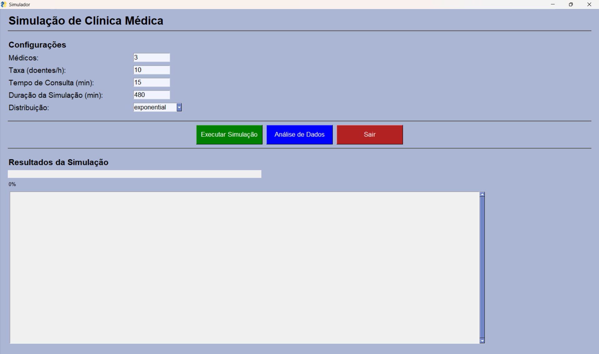
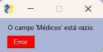
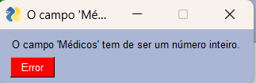
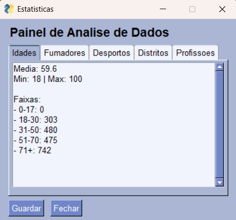
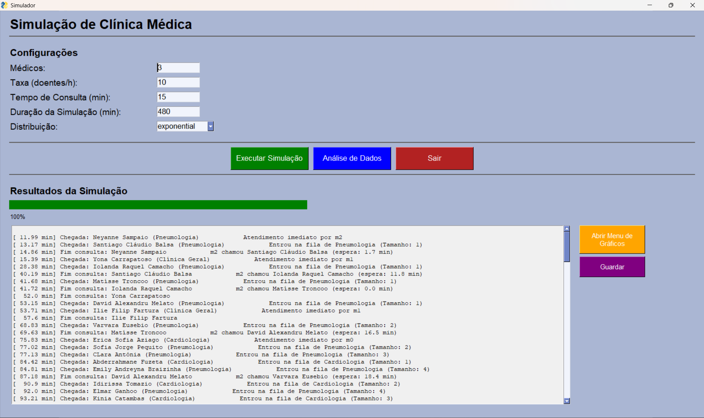
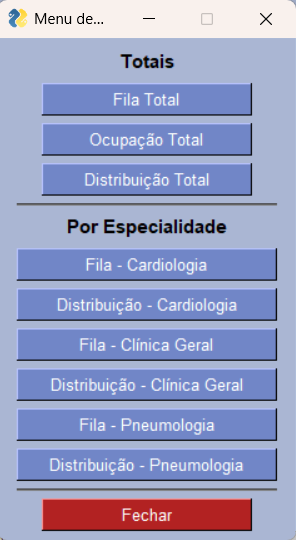
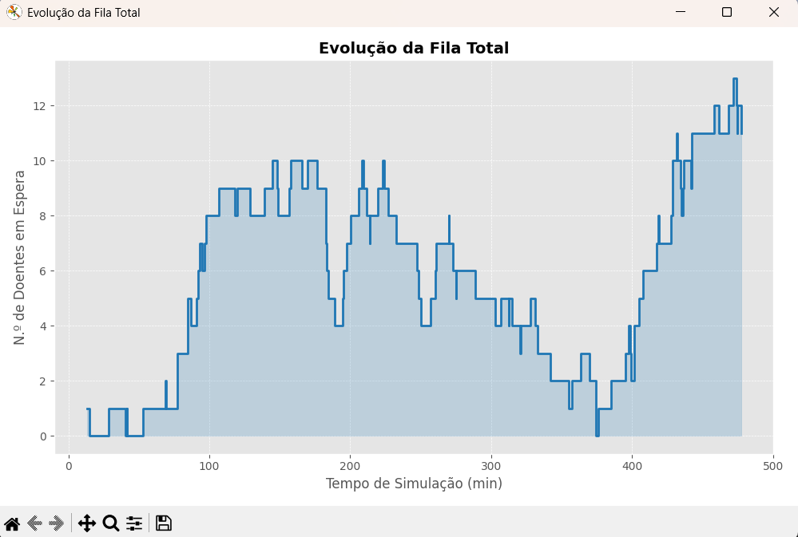

# Relatório do Projeto: Simulação de uma Clínica Médica

## 1. Identificação do Projeto

**Autores:** 

Bárbara Jacques, (a109722)  
Esmeralda Freitas, (a109932)  
Martim Rocha, (a112252) 

**Data:** 29 de dezembro de 2025


**Unidade Curricular:** Algoritmos e Técnicas de Programação  
**Curso:** Licenciatura em Engenharia Biomédica (2.º ano)  
**Instituição:** Universidade do Minho – Escola de Engenharia  
**Projeto laboratorial coordenado por:** José Carlos Ramalho, Luís Filipe Cunha

---

## 2. Introdução

No âmbito da unidade curricular de Algoritmos e Técnicas de Programação, foi proposto o desenvolvimento de uma aplicação em Python destinada à **simulação do funcionamento de uma clínica médica**. O objetivo principal do projeto consiste em modelar, de forma realista, o atendimento de doentes numa clínica, recorrendo a processos probabilísticos e a uma simulação de eventos discretos.

A aplicação permite analisar o impacto de diferentes parâmetros, tais como a taxa de chegada de doentes, o número de médicos disponíveis e o tempo médio de consulta, no desempenho global do sistema.

## 3. Objetivos do Sistema

Os principais objetivos do sistema desenvolvido são:

* Simular a chegada de doentes a uma clínica médica segundo uma distribuição de Poisson;
* Simular o atendimento médico com tempos de consulta aleatórios, seguindo distribuições estatísticas apropriadas;
* Registar métricas de desempenho como tempos de espera, tamanho da fila e ocupação dos médicos;
* Gerar gráficos que representem a evolução desses indicadores ao longo do tempo;
* Permitir a variação dos parâmetros da simulação e a análise do impacto dessas alterações nos resultados.

---

## 4. Descrição Geral do Funcionamento

O funcionamento básico da simulação segue o seguinte fluxo:

* Os doentes chegam à clínica de forma aleatória, de acordo com uma distribuição de Poisson com parâmetro λ;
* Caso exista um médico disponível, o doente é atendido de imediato;
* Caso contrário, o doente entra numa fila de espera (queue);
* O tempo de consulta é gerado aleatoriamente, seguindo uma distribuição exponencial, normal ou uniforme;
* Após o término da consulta, o doente abandona a clínica e o médico fica disponível para atender outro doente.

Todo o sistema é baseado numa **simulação de eventos discretos**, onde os principais eventos são a chegada e a saída de doentes.

### 4.1 Parâmetros de Configuração

A aplicação permite configurar diversos parâmetros relevantes para a simulação, entre os quais:

* Taxa de chegada de doentes (doentes por hora);
* Número de médicos disponíveis;
* Tipo de distribuição do tempo de consulta;
* Tempo médio de consulta;
* Duração total da simulação.

Estes parâmetros podem ser alterados de modo a testar diferentes cenários e analisar o comportamento do sistema.

### 4.2 Resultados Produzidos

Durante a execução da simulação, são recolhidos diversos indicadores de desempenho, nomeadamente:

* Tempo médio de espera dos doentes;
* Tempo médio de consulta;
* Tempo médio total de permanência na clínica;
* Tamanho médio e máximo da fila de espera;
* Percentagem de ocupação dos médicos;
* Número total de doentes atendidos.

### 4.3 Gráficos Gerados

Com base nos dados recolhidos, a aplicação gera vários gráficos, entre os quais:

* Evolução do tamanho da fila de espera ao longo do tempo;
* Evolução da taxa de ocupação dos médicos ao longo da simulação;
* Relação entre a taxa de chegada de doentes e o tamanho médio da fila de espera;
* Outros gráficos adicionais considerados relevantes para a análise do sistema.

### 4.4 Interface Gráfica

A aplicação dispõe de uma interface gráfica desenvolvida com o módulo **SimpleGUI**, permitindo:

* Executar a simulação;
* Alterar os parâmetros do sistema;
* Visualizar os gráficos gerados;
* (Funcionalidade extra) Visualizar graficamente a fila de espera e a ocupação dos consultórios.

A interface foi concebida de forma a facilitar a interação do utilizador com a simulação e a interpretação dos resultados obtidos.

## 5. Interface 
### 5.1 Configuração da Simulação (Pré-Simulação)

Na fase inicial, o utilizador tem acesso a uma janela de configuração onde pode definir os principais parâmetros da simulação, tais como a taxa de chegada de doentes, o número de médicos disponíveis e a duração média das consultas. Estes parâmetros são fundamentais para caracterizar o comportamento do sistema e influenciam diretamente os resultados obtidos.

<p align="center">
  
  <br>
  <em>Figura 1: Janela de configuração inicial da simulação.</em>
</p>


Antes de iniciar a simulação, são efetuadas validações automáticas aos dados introduzidos, garantindo que todos os campos obrigatórios se encontram preenchidos e que os valores inseridos são compatíveis com o tipo esperado.

---

### 5.2 Execução da Simulação

Após a correta configuração dos parâmetros, o utilizador pode dar início à simulação. Durante esta fase, o sistema processa os eventos de chegada e atendimento dos doentes de acordo com os modelos probabilísticos definidos.

<p align="center">
  
  <br>
  <em>Figura 2: Barra de progresso durante a execução da simulação.</em>
</p>


Para fornecer feedback contínuo ao utilizador, é apresentada uma barra de progresso que indica o estado de execução da simulação, permitindo acompanhar visualmente a sua evolução.

---

### 5.3 Tratamento de Erros e Validação de Dados

Com o objetivo de aumentar a robustez da aplicação, foram implementados mecanismos de tratamento de erros. Sempre que o utilizador insere dados inválidos, como campos vazios ou valores não numéricos, o sistema apresenta mensagens de aviso claras, orientando o utilizador para a correção do erro.

<p align="center">
  
  
  <br>
  <em>Figura 3: Exemplos de mensagens de erro apresentadas ao utilizador.</em>
</p>


---

### 5.4 Análise de Dados

Após a conclusão da simulação, o utilizador pode aceder à janela de análise de dados, onde são apresentadas estatísticas relevantes sobre os doentes atendidos e o desempenho do sistema. Esta análise inclui, entre outros aspetos, a distribuição etária, a identificação de perfis de risco e informações gerais sobre a população simulada.

<p align="center">
  
  <br>
  <em>Figura 4: Janela de análise de dados demográficos da simulação.</em>
</p>


---

### 5.5 Visualização Gráfica dos Resultados

A aplicação disponibiliza ainda um menu dedicado à visualização gráfica dos resultados obtidos. 

<p align="center">
  
  <br>
  <em>Figura 5: Botão menu gráficos.</em>
</p>


Através deste menu, o utilizador pode selecionar diferentes gráficos que representam métricas importantes, como a evolução da fila de espera, o número de doentes atendidos ou o desempenho por especialidade.

<p align="center">
  
  <br>
  <em>Figura 5.1: Menu de seleção de gráficos estatísticos.</em>
</p>


Após a seleção, o gráfico correspondente é gerado e apresentado numa nova janela, facilitando a interpretação visual dos resultados da simulação.

<p align="center">
    
    
    <br>
    <em>Figura 6: Exemplos de gráficos gerados a partir dos resultados da simulação.</em>
</p>

---

Em conjunto, estas funcionalidades tornam a interface gráfica uma componente essencial do sistema, permitindo não só a configuração e execução da simulação, mas também uma análise clara e estruturada dos resultados obtidos.

## 6. Integração de Dados Reais de Doentes

Para tornar a simulação mais realista e alinhada com um contexto clínico real, foi integrada a utilização de um **dataset de pessoas em formato JSON**, fornecido no âmbito do projeto. Em vez de trabalhar apenas com identificadores abstratos de doentes, o sistema passa a lidar com pessoas reais, caracterizadas por atributos demográficos e comportamentais.

### 6.1 Exemplo de Estrutura do Dataset JSON

O ficheiro JSON utilizado contém uma lista de pessoas, onde cada elemento representa um possível doente da clínica. Cada registo inclui informação como nome, idade, morada, hábitos de saúde e outros atributos relevantes. Um excerto simplificado do dataset é apresentado de seguida:

```json
{
  "nome": "Neyanne Sampaio",
  "idade": 47,
  "sexo": "feminino",
  "morada": {
    "cidade": "Ferreira do Alentejo",
    "distrito": "Beja"
  },
  "profissao": "Programador de aplicações",
  "desportos": ["Peteca", "Rugby de praia"],
  "atributos": {
    "fumador": true,
    "gosta_musica": true,
    "comida_favorita": "vegetariana"
  },
  "id": "p0"
}
```

### 6.2  Carregamento e Validação dos Dados

O carregamento do dataset é realizado através de uma função dedicada, responsável por ler o ficheiro JSON e devolver a lista de pessoas a utilizar na simulação:

```python
import json

def carregar_e_validar(caminho):
    """Carrega o JSON e devolve a lista de pessoas."""
    with open(caminho, "r", encoding="utf-8") as f:
        dados = json.load(f)
    return dados
```

### 6.3 Cálculo de Estatísticas Demográficas

A partir da lista de pessoas carregada, são calculadas várias estatísticas que permitem caracterizar a população atendida pela clínica. Por exemplo, o cálculo da idade média, mínima e máxima é realizado da seguinte forma:

```python
def estatisticas_idades(lista):
    soma = 0
    contagem = 0
    min_idade = 999
    max_idade = -1

    for p in lista:
        idade = p["idade"]
        soma += idade
        contagem += 1
        if idade < min_idade:
            min_idade = idade
        if idade > max_idade:
            max_idade = idade

    return {
        "media": soma / contagem if contagem > 0 else 0,
        "min": min_idade,
        "max": max_idade,
        "total": contagem
    }
```

De forma semelhante, são implementadas funções para calcular a distribuição por distrito, hábitos de consumo (fumadores e não fumadores), prática de desporto, profissões mais frequentes e faixas etárias.

Estas estatísticas permitem enriquecer a análise da simulação, possibilitando estudos adicionais como o impacto da idade, localização geográfica ou estilo de vida na procura por determinadas especialidades médicas.

Além disso, os resultados estatísticos obtidos podem ser representados graficamente e **exportados para ficheiros JSON e TXT**, assegurando persistência dos dados, reprodutibilidade das experiências e facilidade de análise posterior.

Para tornar a simulação mais realista e alinhada com um contexto clínico real, foi integrada a utilização de um **dataset de pessoas em formato JSON**, fornecido no âmbito do projeto. Em vez de trabalhar apenas com identificadores abstratos de doentes, o sistema passa a lidar com pessoas reais, caracterizadas por atributos demográficos e comportamentais.

O carregamento e validação dos dados é realizado através de funções dedicadas, garantindo uma separação clara entre a lógica da simulação e o tratamento de dados. A partir deste conjunto de dados são extraídas diversas **estatísticas relevantes**, que permitem caracterizar a população atendida pela clínica.

As estatísticas calculadas incluem:

* **Distribuição etária**: cálculo da idade média, mínima e máxima dos doentes, bem como a sua distribuição por faixas etárias;
* **Distribuição geográfica**: análise da frequência de doentes por distrito;
* **Hábitos de saúde**: distinção entre fumadores e não fumadores;
* **Atividade física**: frequência da prática de diferentes desportos;
* **Perfil profissional**: identificação das profissões mais comuns entre os doentes.

Estas métricas permitem enriquecer a análise da simulação, possibilitando estudos adicionais como o impacto da idade ou do estilo de vida na procura por determinadas especialidades médicas.

Além disso, os resultados estatísticos obtidos podem ser representados graficamente e **exportados para ficheiros JSON e TXT**, assegurando persistência dos dados, reprodutibilidade das experiências e facilidade de análise posterior.

## 7. Tecnologias Utilizadas

Para o desenvolvimento do sistema, foi necessária a importação de bibliotecas e módulos, de modo a conseguir realizar o programa da forma mais eficiente possível. As bibliotecas e os módulos em questão são:

* **Python** – linguagem de programação principal;
* **SimpleGUI** – desenvolvimento da interface gráfica;
* **NumPy** – geração de variáveis aleatórias e apoio ao cálculo estatístico;
* **Matplotlib** – criação de gráficos e visualizações;
* **JSON** – armazenamento e configuração de parâmetros.

## 8. Metodologia de Simulação

O sistema utiliza uma abordagem de **simulação de eventos discretos**, mantendo uma lista ordenada de eventos futuros. Cada evento corresponde a uma chegada ou saída de um doente. O estado do sistema é atualizado à medida que os eventos são processados, permitindo calcular métricas de desempenho em tempo real.

Os médicos são modelados como recursos que podem estar ocupados ou livres, e a fila de espera é representada por uma estrutura de dados do tipo queue.

A utilização de especialidades médicas e a atribuição automática dos doentes com base em características como a idade e hábitos de saúde permitiu tornar a simulação mais realista. Esta abordagem aproxima o comportamento do sistema a um cenário clínico real, onde diferentes perfis de doentes recorrem a especialidades distintas, influenciando diretamente a dinâmica da fila de espera e a ocupação dos médicos.


### 8.1 Estrutura do Código e Modularização

O código desenvolvido foi organizado de forma modular, de modo a facilitar a leitura, manutenção e extensão do sistema. Cada conjunto de funções desempenha uma responsabilidade específica, promovendo a separação de preocupações.

O módulo de **análise de dados** é responsável pelo carregamento e validação do dataset de pessoas, bem como pelo cálculo de estatísticas demográficas, como distribuição etária, hábitos de saúde, localização geográfica e profissões mais frequentes.

O módulo de **simulação** implementa o núcleo da simulação de eventos discretos, incluindo a gestão da fila de eventos, o estado dos médicos, a atribuição de especialidades e o processamento das chegadas e saídas de doentes.

As funções de **visualização gráfica** encontram-se isoladas num módulo próprio, permitindo gerar gráficos independentes da lógica da simulação, como a evolução do tamanho da fila e a taxa de ocupação dos médicos.

Por fim, o módulo da **interface gráfica** coordena a interação com o utilizador, assegurando a validação de dados, a execução da simulação, a apresentação dos resultados e a exportação dos relatórios.

### 8.2 Funcionamento do Núcleo da Simulação
#### 8.2.1 Visão Geral da Função simula

O núcleo do sistema encontra-se implementado na função simula, responsável por coordenar todo o processo de simulação do funcionamento da clínica médica. Esta função integra a geração de eventos, a gestão da fila de espera, a atribuição de médicos, a recolha de métricas estatísticas e a interação com a interface gráfica.

A função simula implementa uma simulação de eventos discretos, sendo responsável por controlar o tempo da simulação e o processamento sequencial dos eventos de chegada e saída dos doentes.

#### 8.2.2 Importação de Módulos e Definição de Constantes

O sistema recorre a vários módulos externos para assegurar funcionalidades específicas:

* ```json``` para carregamento do dataset de pessoas;
* ```numpy``` para cálculo de médias estatísticas;
* ```manipulacao``` (importado como mani) onde se encontram funções auxiliares de geração de tempos, gestão de médicos e filas
* ```FreeSimpleGUI``` para a interface gráfica.

São ainda definidas duas constantes simbólicas, CHEGADA e SAIDA, que identificam os tipos de eventos processados na simulação, aumentando a clareza e legibilidade do código.

```
import json
import numpy as np
import manipulacao as mani
import FreeSimpleGUI as sg

CHEGADA = 0
SAIDA = 1
```


#### 8.2.3 Carregamento do Dataset e Definição das Especialidades

O ficheiro pessoas.json é carregado no início da execução e armazenado na variável PESSOAS. Este dataset contém informação realista sobre indivíduos, permitindo que cada doente da simulação possua atributos próprios.

```
with open("pessoas.json", "r", encoding="utf-8") as f:
    PESSOAS = json.load(f)

especialidades = ["Cardiologia", "Clínica Geral", "Pneumologia"]
```

#### 8.2.4 Inicialização da Simulação

A função ```simula``` recebe como parâmetros o número de médicos, a taxa de chegada de doentes, o tempo médio de consulta, a duração total da simulação e o tipo de distribuição estatística a utilizar.

```
def simula(n_medicos, taxa_chegada, tempo_medio, tempo_simulacao, distribuicao):
    mani.N_MEDICOS = n_medicos
    mani.TAXA_CHEGADA = taxa_chegada
    mani.TEMPO_MEDIO = tempo_medio
    mani.DISTRIBUICAO = distribuicao 
```


São inicializadas as principais estruturas de dados:

```
    queueEventos = []
    fila_espera = {esp: [] for esp in especialidades}
    medicos = mani.criarMedicos(n_medicos, especialidades)

    chegadas_d = {}
    ent_consulta_d = {}
    saida_d = {}

    hist_fila = []
    hist_fila_esp = {esp: [] for esp in especialidades}
    hist_ocupa = [] 
  ```

#### 8.2.5 Geração dos Eventos de Chegada

Antes do início do ciclo principal, são gerados todos os eventos de chegada até ao final da simulação. O intervalo entre chegadas é calculado com base numa distribuição probabilística.

#### 8.2.6 Ciclo Principal de Eventos

A simulação decorre num ciclo while, onde os eventos são processados por ordem temporal.

```
while queueEventos:
    tempo_atual, tipo, pessoa, esp = mani.dequeue(queueEventos)
    ocupacao = mani.calcular_ocupacao(medicos)
    hist_ocupa.append((tempo_atual, ocupacao))
```

Durante esta fase, se a interface gráfica estiver ativa, é atualizada uma barra de progresso que reflete a percentagem da simulação já concluída.

#### 8.2.7 Tratamento de Eventos de Chegada 

```
if tipo == CHEGADA:
    medico = mani.procuraMedico(medicos, esp)
    if medico:
        duracao = mani.gera_tempo_consulta()
        mani.enqueue(queueEventos, (tempo_atual + duracao, SAIDA, pessoa, esp))
        ent_consulta_d[pessoa["id"]] = tempo_atual
    else:
        fila_espera[esp].append((tempo_atual, pessoa)) 
``` 

#### 8.2.8 Tratamento de Eventos de Saída

```
elif tipo == SAIDA:
    mani.libertarMedico(medicos, esp)
    saida_d[pessoa["id"]] = tempo_atual

    if fila_espera[esp]:
        tempo_chegada, prox = fila_espera[esp].pop(0)
        duracao = mani.gera_tempo_consulta()
        mani.enqueue(queueEventos, (tempo_atual + duracao, SAIDA, prox, esp))
```

#### 8.2.9 Cálculo das Estatísticas Finais

Após o processamento de todos os eventos, são calculadas métricas globais de desempenho, como tempos médios de espera e permanência na clínica.

```
media_espera = np.mean(list(ent_consulta_d.values())) if ent_consulta_d else 0
media_clinica = np.mean(list(saida_d.values())) if saida_d else 0
```

Estas métricas são devolvidas juntamente com os históricos temporais, permitindo a geração de gráficos e a exportação dos resultados.

#### 8.2.10 Considerações Finais

A função simula implementa uma simulação de eventos discretos completa, integrando geração probabilística de eventos, gestão de recursos, filas de espera por especialidade e recolha sistemática de dados estatísticos.

A separação entre a lógica da simulação e os módulos auxiliares contribui para um código modular, legível e facilmente extensível.

## 9. Desafios e Soluções

Durante o desenvolvimento do projeto foram identificados vários desafios, nomeadamente:

* A correta modelação do comportamento estocástico do sistema;
* A gestão eficiente da fila de espera;
* A recolha consistente de métricas ao longo da simulação;
* A integração de dados reais com a lógica da simulação.

Estes desafios foram ultrapassados através de uma estruturação cuidada do código, desenvolvimento de funções modulares e realização de testes com diferentes cenários.

---

## 10. Conclusão

O desenvolvimento deste projeto permitiu consolidar os conhecimentos adquiridos na Unidade Curricular de **Algoritmos e Técnicas de Programação**, nomeadamente no que diz respeito à programação em Python, manipulação de dados e desenvolvimento de interfaces.

A simulação de uma clínica médica revelou-se uma aplicação prática e relevante, possibilitando a análise do impacto de diferentes parâmetros no desempenho do sistema. Conclui-se que os objetivos propostos foram atingidos, resultando numa aplicação funcional, extensível e alinhada com os requisitos definidos para o projeto.

